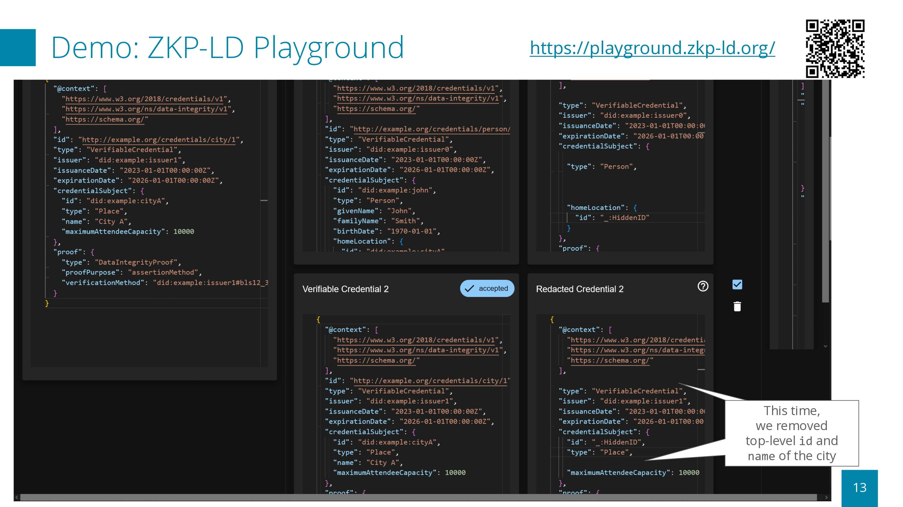
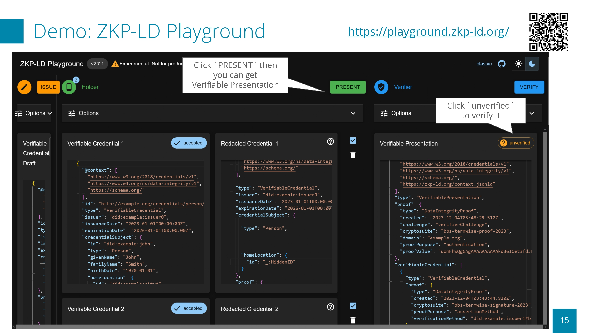
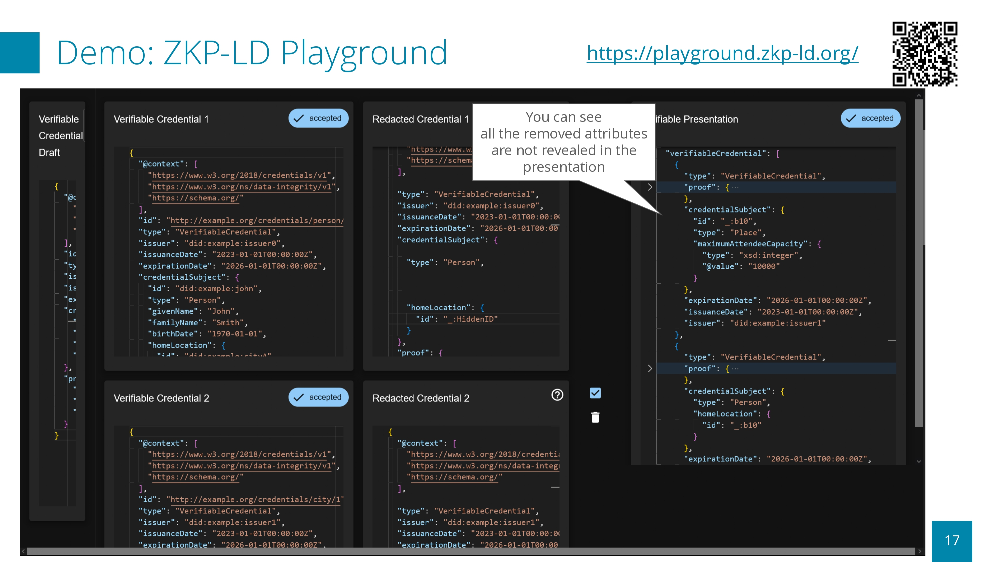
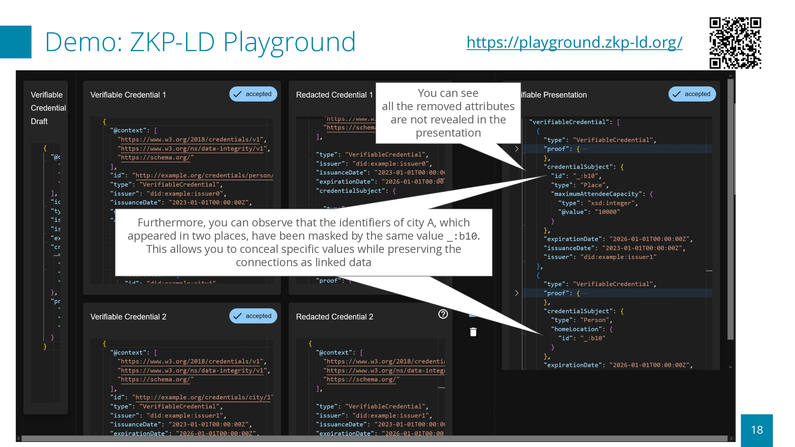

# ZKP-LD Playground

**Experimental**: Do not use in production

- Playground for ZKP-LD: Zero-Knowledge Proof of Linked Data
- You can sign and verify JSON-LD-based Verifiable Credentials (VCs) using a experimental version of BBS+ signatures with Data Integrity
- You can derive and verify proofs from multiple VCs, supporting "user-friendly" selective disclosure and proof of termwise equality

- Built on [jsonld-proofs](https://github.com/zkp-ld/jsonld-proofs), [rdf-proofs-wasm](https://github.com/zkp-ld/rdf-proofs-wasm), [rdf-proofs](https://github.com/zkp-ld/rdf-proofs), and [docknetwork/crypto](https://github.com/docknetwork/crypto)
- Supports "user-friendly" selective disclosure (TODO: elaborate further)

- Hosted at <https://playground.zkp-ld.org>

- For a detailed guide, visit our [documentation](public/document.pdf).

## Prerequisites for development

- Node.js
- npm

## How to run a local server

Clone this repository and run the app:

```bash
$ git clone https://github.com/zkp-ld/zkp-ld-playground.git
$ cd zkp-ld-playground
$ npm install
$ npm run dev
```

Then, open [http://localhost:5173](http://localhost:5173) to view it in your browser.

## Overview

ZKP-LD Playground is a web-based demonstration application for experimenting with Linked Data-based Verifiable Credentials (VCs) that support selective disclosure and zero-knowledge proofs.
It allows you to issue VCs, selectively disclose attributes when presenting them, and verify the presented VCs with predicate proofs.

This application has many features below:

- Generate Verifiable Credentials (VCs)
- Present a Verifiable Presentation (VP) from multiple VCs
- Selective disclosure
- Secret Holder Binding for VC
- Predicate Proof
  - Range Proof for Integer
  - Range Proof for Datetime

## Tutorial

You can download the document below as a file from [here](public/document.pdf).








